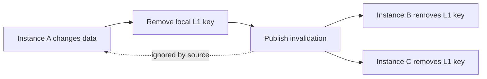

# Invalidation Model

Invalidation removes local L1 entries from peer application instances after data changes.

Each running cache instance has a source identity. When it publishes an invalidation message, other instances apply it and the sender ignores its own message. This prevents a process from doing duplicate work for the change it already made locally.

Invalidation messages support two actions:

| Action | Effect |
| --- | --- |
| Remove one key | Deletes one local L1 entry |
| Clear | Clears all local L1 entries |

Invalidation is separate from distributed storage. A Redis distributed cache stores shared values; an invalidation bus tells local process caches when to drop stale local copies.
