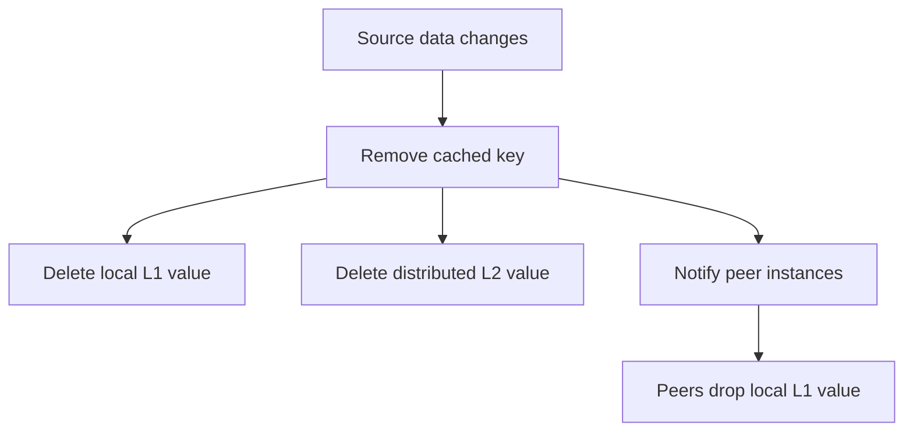

# Invalidate Cached Data

Invalidate cached data when your application changes the source record or when an operator needs to force a refresh.



## Remove one key

```python
await cache.remove("user:123")
```

This removes the key from local memory, deletes it from distributed storage when configured, and publishes an invalidation message when an invalidation bus is configured.

## Remove the key for a cached function call

```python
await get_user.remove_cached("123")
```

Use this when you decorated the read path and want to invalidate using the same arguments.

## Clear local memory and peer instances

```python
await cache.clear()
```

`clear()` clears the current process and publishes a clear message to peer instances. It does not delete every key from a distributed cache.

## Remove only this process's local copy

```python
cache.remove_local("user:123")
cache.clear_memory()
```

Use local-only operations for application-specific recovery paths where you do not want to notify other instances.
