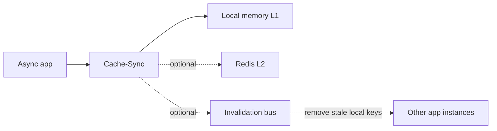

# Cache-Sync

`Cache-Sync` helps async Python applications cache expensive work in local memory, optionally share values through Redis, and keep multiple application instances in sync with an invalidation bus.

## Choose your path

-   **Get a first cache working**

    Start with an in-memory cache, then add Redis when you need shared values.

    [Get started](tutorials/get-started.md)

-   **Configure runtime behavior**

    Set TTLs, fail-safe stale reads, hard timeouts, and jitter for your app.

    [Configure cache policy](how-to/configure-cache-policy.md)

-   **Run more than one app instance**

    Choose Redis Streams, RabbitMQ, Kafka, or PostgreSQL notifications for invalidation.

    [Choose an invalidation bus](how-to/choose-invalidation-bus.md)

-   **Look up exact behavior**

    Check provider capabilities, decorator key behavior, options, and serializers.

    [Reference](reference/index.md)

## Documentation map

This site follows the Diataxis documentation model:

- **Tutorials** take you through a successful first result.
- **How-to guides** solve a specific task in your application.
- **Reference** lists exact options, defaults, and provider behavior.
- **Explanation** describes the ideas behind the cache so you can make good decisions.
